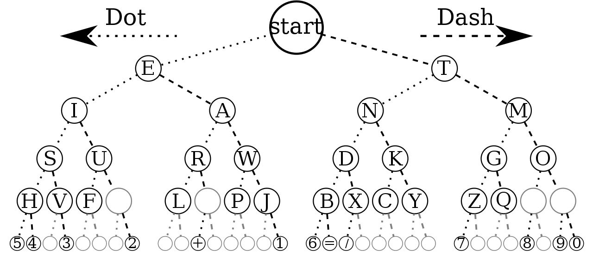
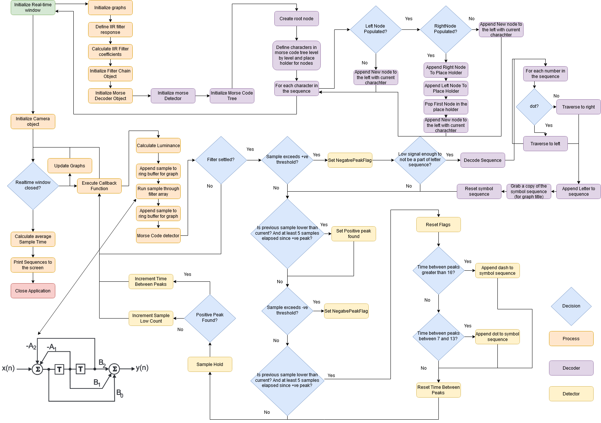

# Morse Code Decoder - Digital Signal Processing IIR Filter Assignment @ UoG


The coding language is Python.

# Dependencies

```
pip3 install opencv-contrib-python
pip3 install opencv-python
```

# Description

Morse Code Decoder using a webcam, based on binary tree encoding.

The relative luminance is measured and a high-pass IIR filter is applied to remove the DC offset from the signal, the filtered output is passed to the detector which adds dots and dashes to the sequence. The sequences are decoded upon next exceed of the threshold.



# Flow Diagram



# Running Instructions

Webcam must be running at 30Hz!
Dot time must be set to 300ms!

Run realtime_iir_main.py

For best effect start with the phone in the position about 0.5-1m away but in line with camera and minimize your movement to reduce changes in relative luminance.
Filter must first settle so the program is not going to decode anything until 5 seconds elapse, assuming sampling frequency is 30Hz.


## Demo

The [Demo](https://www.youtube.com/watch?v=HxUDQ35N-YI)
The [application](https://play.google.com/store/apps/details?id=pl.acform.android.torch) used in demo.
